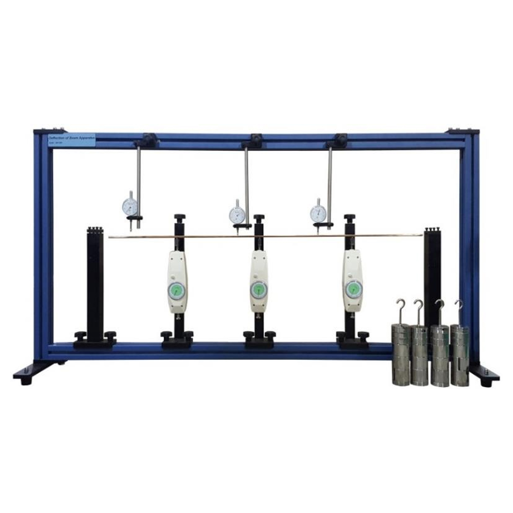

# 简支梁力学分析与挠度监测系统

[](https://github.com/DUSK1NG/py_pro/actions/workflows/tests.yml)
[](https://www.python.org/)
[](https://streamlit.io/)

这是一个面向材料力学实验的简支梁理论分析与静态图片挠度测量工具，支持三类静力荷载、OpenCV 图像识别、理论/实测对比和数据导出。

> 当前版本采用“上传两张静态图片”的方案，不包含视频、实时摄像头和连续帧监测。

## 当前功能

- 跨中集中力、任意位置集中力、满跨均布荷载；
- 支座反力、剪力、弯矩和理论挠度计算；
- 剪力图、弯矩图和挠度曲线；
- 矩形截面、圆形截面和自定义截面惯性矩；
- 长度、荷载和弹性模量单位下拉选择；
- 弹性模量支持 MPa 和 GPa；
- 可选导出 Markdown 或 PDF 理论分析报告；
- 77 项自动化测试。

OpenCV 采用静态图片方案：用户上传未加载图片和加载后图片，完成标记点识别、像素标定、完整挠度曲线和理论/实测对比。本项目不包含视频读取、实时摄像头或连续帧监测功能。

## 安装与运行

### 环境要求

- Python 3.11 或更高版本；
- Windows、macOS 或 Linux；
- 建议使用虚拟环境；
- OpenCV 仅用于静态图片处理，不需要摄像头。

### Windows PowerShell

在 GitHub 项目页面点击 **Code → Download ZIP** 解压，或使用 Git 克隆：

```powershell
git clone https://github.com/DUSK1NG/py_pro.git
cd py_pro
python -m venv .venv
.venv\Scripts\Activate.ps1
python -m pip install --upgrade pip
python -m pip install -r requirements.txt
```

启动界面：

```powershell
streamlit run app_styled.py
```

浏览器打开 Streamlit 显示的本地地址，通常为 `http://localhost:8501`。

### macOS / Linux

```bash
git clone https://github.com/DUSK1NG/py_pro.git
cd py_pro
python3 -m venv .venv
source .venv/bin/activate
python -m pip install --upgrade pip
python -m pip install -r requirements.txt
streamlit run app_styled.py
```

### 运行测试

安装依赖后，在项目根目录执行：

```powershell
python -m pytest -q
```

当前测试数量为 77 项。GitHub Actions 会在每次推送和 Pull Request 时自动执行测试。

### Windows 常见问题

如果 PowerShell 阻止虚拟环境激活，可仅对当前用户允许脚本执行：

```powershell
Set-ExecutionPolicy -Scope CurrentUser RemoteSigned
```

如果系统没有 `python` 命令，可以尝试使用 `py`：

```powershell
py -3.11 -m venv .venv
.venv\Scripts\Activate.ps1
```

## 启动界面

推荐启动优化后的界面：

```powershell
streamlit run app_styled.py
```

基础界面仍可通过以下命令启动：

```powershell
streamlit run app.py
```

## 项目结构

```text
mechanics/       力学计算、荷载模型和截面属性
vision/          静态图片识别、曲线提取和 Streamlit 图像区
visualization/   剪力、弯矩和挠度图
utils/           单位、校验、对比、报告和 CSV 导出
tests/           理论、图像、导出和界面相关测试
sample_data/     示例 CSV 和实验装置参考图
docs/            实验说明、报告提纲和答辩提纲
```

## 快速体验

1. 启动 `app_styled.py`；
2. 输入梁长、荷载、材料和截面参数；
3. 点击“开始计算”查看理论结果；
4. 在“图像测量”中上传未加载图和加载图；
5. 在“荷载—挠度数据分析”中上传 `sample_data/load_deflection_example.csv`；
6. 下载 CSV、PNG 或 Markdown/PDF 报告。



图片仅作实验装置参考，来源和使用说明见 [sample_data/README.md](sample_data/README.md)。

## 输入单位

程序内部统一换算为：

- 长度：mm；
- 力：N；
- 均布荷载：N/mm；
- 弹性模量：MPa，即 N/mm²；
- 截面惯性矩：mm⁴；
- 挠度：mm。

界面会自动换算 `m`、`kN`、`GPa` 等可选单位，并拒绝非数值、无穷大、零或负数等非法输入。

## 教材题模式

教材题模式用于录入由多个支座、集中力和区间均布载荷组成的平面梁题；所有数据均使用内部单位 mm、N、MPa、mm⁴。支座类型为 `pin`（铰支）、`roller`（滚动支座）、`fixed`（固定端）和 `free`（自由端）。当前只求解竖向弯曲：`pin` 与 `roller` 不计算水平反力，`fixed` 同时给出竖向反力与端弯矩。

可添加多个集中力，并为每个均布载荷填写起点、终点和强度，因此可表示多个荷载及其作用范围。符号约定为向上力为正、向下载荷为负；正弯矩为下缘受拉的挠曲方向，挠度向下为负。

标准的左铰右滚简支梁和端部固定的悬臂梁使用解析解。支座多于静定所需约束、支座布置不属于标准解析构型时，程序自动进入 FEM（有限元）数值解；约束不足的机构会提示无法建立稳定模型。

可运行的 JSON 示例位于 [sample_data/textbook_examples.json](sample_data/textbook_examples.json)，包括 1 m 跨中集中力、部分均布载荷和悬臂端点集中力。启动 Streamlit：

```powershell
streamlit run app_styled.py
```

教材题结果可导出为 CSV 图表数据，以及 Markdown 或 PDF 报告；图像测量与荷载—挠度数据的既有导出能力不受影响。

## 截面惯性矩

在 `app_styled.py` 中选择截面类型：

- 矩形截面：`I = b × h³ / 12`；
- 圆形截面：`I = π × d⁴ / 64`；
- 自定义：直接输入 `I`，单位为 mm⁴。

矩形宽度 `b`、高度 `h` 和圆形直径 `d` 均以 mm 输入。

## 报告导出

完成理论计算后，点击结果区的“导出报告”弹窗，可选择 Markdown 或 PDF 格式。报告包含输入参数、截面信息、支座反力、最大剪力、弯矩和挠度结果；用户不点击生成时不会创建文件。

## 图像测量

在结果页面的“图像测量”区域上传未加载图片和加载后图片，可以：

- 识别高对比度跨中标记点；
- 输入标定物实际长度和像素长度；
- 计算跨中实测挠度；
- 选择 ROI 提取完整挠度曲线；
- 查看理论/实测曲线和误差指标。

实验搭建和拍摄要求见 [experiment_guide.md](docs/experiment_guide.md)。

## 数据导出

理论结果、剪力图、弯矩图、理论挠度图、实测曲线和理论/实测对比 CSV 均可从界面下载。Markdown/PDF 报告也会在识别实测数据后包含实测摘要和误差结果。


## 荷载—挠度数据分析

在理论计算完成后，可展开“荷载—挠度数据分析”，上传包含以下字段的 CSV：

```csv
load_n,measured_deflection_mm
0,0.0
20,-0.0021
40,-0.0042
```

程序会按荷载排序，计算当前梁参数下的理论跨中挠度，显示荷载—挠度曲线、绝对误差和相对误差，并提供对比 CSV 下载。示例文件位于 `sample_data/load_deflection_example.csv`。示例数据只用于演示，不能替代真实实验数据。
## 当前模型适用条件

两端为理想简支，梁为均匀等截面，材料处于线弹性和小挠度范围。不考虑剪切变形、塑性、自重、动态荷载和复杂组合荷载。

## 验算示例

给定 `L=1000 mm`、`P=100 N`、`E=200000 MPa`、`I=1000000 mm⁴`：

- 左右支座反力：`50 N`；
- 最大剪力绝对值：`50 N`；
- 最大弯矩：`25000 N·mm`；
- 最大挠度位置：跨中 `500 mm`；
- 跨中挠度：`-0.0104167 mm`（负号表示向下）。
